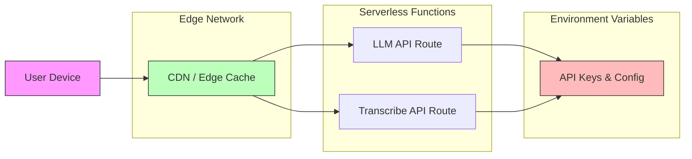

# Design Document: RAASTA AI Companion

## Overview

RAASTA (Rural AI Assistant for Support, Training, and Assistance) is a production-ready AI companion application designed for rural Kashmir and India. The system provides four integrated modes serving users with limited literacy and English proficiency through voice-first interactions and visual interfaces.

The application addresses critical needs in rural communities:
- Document understanding for government notices and forms (Samjho)
- Crop disease detection and market price information (Zameen)
- Youth services including jobs, skills, mental health, and entrepreneurship (Taleem)
- Voice-based question answering (Raah)

The current implementation includes a functional prototype with demo/fallback data. This design focuses on production API integration, performance optimization, and deployment readiness while maintaining the offline-first demo capability for presentations.

### Design Goals

1. **Accessibility**: Voice-first design for users with limited literacy
2. **Multilingual**: Support for Roman Urdu, Kashmiri (Latin script), and Hindi
3. **Resilience**: Graceful degradation with demo mode when APIs unavailable
4. **Performance**: Optimized for 2G/3G mobile networks in rural areas
5. **Production-Ready**: Full API integration with proper error handling and monitoring

### Target Users

- Rural farmers needing crop disease diagnosis and market prices
- Citizens with limited literacy requiring document explanation
- Youth seeking employment, skills training, and mental health support
- Users preferring voice interaction over text-based interfaces

## Architecture

### System Architecture

```mermaid
graph TB
    subgraph "Client Layer"
        UI[Next.js UI Components]
        ClientAPI[Client API Wrappers]
    end
    
    subgraph "API Layer"
        LLMRoute[/api/llm]
        TranscribeRoute[/api/transcribe]
    end
    
    subgraph "Service Layer"
        OCR[OCR Service]
        Vision[Vision Service]
        LLM[LLM Service]
        Whisper[Whisper Service]
        TTS[TTS Service]
        Mandi[Mandi API]
    end
    
    subgraph "External Services"
        OpenAI[OpenAI API]
        CloudVision[Google Cloud Vision]
        Roboflow[Roboflow API]
        ElevenLabs[ElevenLabs TTS]
        AgmarkNet[Agmarknet Mandi]
    end
    
    UI --> ClientAPI
    ClientAPI --> LLMRoute
    ClientAPI --> TranscribeRoute
    
    LLMRoute --> OCR
    LLMRoute --> Vision
    LLMRoute --> LLM
    LLMRoute --> Mandi
    
    TranscribeRoute --> Whisper
    
    OCR --> CloudVision
    Vision --> Roboflow
    LLM --> OpenAI
    Whisper --> OpenAI
    TTS --> ElevenLabs
    Mandi --> AgmarkNet
    
    style UI fill:#f9f,stroke:#333
    style LLMRoute fill:#bbf,stroke:#333
    style TranscribeRoute fill:#bbf,stroke:#333
    style OpenAI fill:#fbb,stroke:#333
```

### Mode Architecture

The application is organized into four primary modes, each with specialized functionality:

**1. Samjho (Document Understanding)**
- Image capture → OCR extraction → LLM explanation → TTS output
- Handles government notices, forms, legal documents
- Extracts deadlines and action items

**2. Zameen (Crop Disease Detection)**
- Image capture → Vision analysis → Disease identification → Treatment advice + Mandi prices → TTS output
- Supports apple, rice, wheat, saffron crops
- Integrates real-time market price data

**3. Taleem (Youth Services)**
- Three pillars: Hunarmand (entrepreneurship), Sukoon (mental health), Kaam Dhundo (job matching)
- Four quick access features: Naukri (job orientation), CV generation, Exam prep, Scholarship matching
- Voice-first forms with text alternatives

**4. Raah (Voice Assistant)**
- Dual voice input: Browser speech recognition + Whisper transcription
- General question answering about schemes, farming, documents
- Acts as navigation hub for other modes

### Technology Stack

| Layer | Technology | Purpose |
|-------|-----------|---------|
| Frontend Framework | Next.js 15 (App Router) | React-based SSR/SSG framework |
| Styling | Tailwind CSS v4 | Utility-first CSS framework |
| Language | TypeScript 5.9 | Type-safe development |
| OCR | Google Cloud Vision / Tesseract.js | Text extraction from images |
| Vision AI | Roboflow API / Custom Model | Crop disease detection |
| LLM | OpenAI GPT-4o-mini | Natural language understanding |
| Speech-to-Text | OpenAI Whisper + Browser SpeechRecognition | Voice input |
| Text-to-Speech | ElevenLabs / Google Cloud TTS / Browser API | Voice output |
| Mandi Prices | Agmarknet API | Agricultural market data |
| Deployment | Vercel / Netlify | Serverless hosting |

### Data Flow Patterns

**Samjho Flow:**
```
User captures document photo
  → ImageUploader component
  → extractTextFromImage(file)
  → OCR Service (Google Vision or Tesseract)
  → explainDocumentSimpleUrdu(ocrText)
  → /api/llm (mode: samjho)
  → LLM generates explanation
  → speakText(explanation)
  → VoiceOutput displays text
```

**Zameen Flow:**
```
User captures crop photo
  → ImageUploader component
  → analyzeCropImage(file)
  → Vision Service (Roboflow or custom model)
  → Identifies disease + fetches mandi price
  → explainCropAdvice(summary, mandiHint)
  → /api/llm (mode: zameen)
  → LLM generates treatment advice
  → speakText(advice)
  → VoiceOutput displays text
```

**Raah Flow:**
```
User speaks or types question
  → MicButton or textarea
  → transcribeAudio(blob) OR direct text
  → answerVoiceQuestion(question)
  → /api/llm (mode: raah)
  → LLM generates answer
  → speakText(answer)
  → VoiceOutput displays text
```

### Deployment Architecture



## Components and Interfaces

### Core Components

#### 1. HomeScreen Component
**Purpose**: Main landing page with mode selection and voice shortcut

**Props**: None

**State**:
- None (stateless presentation component)

**Key Features**:
- Displays four mode cards (Samjho, Zameen, Taleem, Raah)
- Prominent microphone button for quick Raah access
- Chinar leaf branding element
- Responsive 2x2 grid layout

**Interactions**:
- Mode card click → Navigate to mode page
- Microphone button → Navigate to Raah page

#### 2. MicButton Component
**Purpose**: Reusable microphone button for voice interaction

**Props**:
```typescript
interface MicButtonProps {
  navigateToRaah?: boolean
  onActivate?: () => void
}
```

**Key Features**:
- Large circular button with gradient background
- Supports navigation mode or direct activation
- Hover and press visual feedback
- Chinar color scheme

#### 3. ImageUploader Component
**Purpose**: Unified image capture and upload interface

**Props**:
```typescript
interface ImageUploaderProps {
  label: string
  onFile: (file: File | null) => void
  capture?: 'environment' | 'user'
}
```

**Key Features**:
- Camera capture with environment/user facing selection
- File gallery selection
- Displays selected filename
- Accepts image/* formats

#### 4. VoiceOutput Component
**Purpose**: Display text responses with consistent styling

**Props**:
```typescript
interface VoiceOutputProps {
  text: string
  label: string
}
```

**Key Features**:
- Styled card with readable typography
- Only renders when text is available
- Proper text wrapping for long responses
- Consistent spacing and borders

#### 5. TaleemVoiceForm Component
**Purpose**: Reusable form for Taleem voice interactions

**Props**:
```typescript
interface TaleemVoiceFormProps {
  placeholder: string
  buttonLabel: string
  onSubmit: (text: string) => Promise<string>
}
```

**State**:
- input: string
- response: string
- loading: boolean

**Key Features**:
- Textarea for voice-friendly multi-line input
- Loading state management
- Automatic TTS on response
- VoiceOutput integration

#### 6. TaleemSubTabs Component
**Purpose**: Tab navigation within Taleem pillars

**Props**:
```typescript
interface TaleemSubTabsProps {
  tabs: Array<{ id: string; label: string }>
  active: string
  onSwitch: (id: string) => void
}
```

**Key Features**:
- Horizontal tab layout
- Active tab highlighting
- Touch-friendly tap targets

#### 7. PageIntro Component
**Purpose**: Consistent page header with back navigation

**Props**:
```typescript
interface PageIntroProps {
  backHref: string
  backLabel: string
  title: string
  children: React.ReactNode
}
```

**Key Features**:
- Back button with custom label
- Page title
- Description content area
- Consistent spacing

### API Interfaces

#### /api/llm Endpoint

**Request**:
```typescript
type LLMRequest = 
  | { mode: 'samjho'; ocrText: string }
  | { mode: 'zameen'; visionSummary: string; mandiHint: string }
  | { mode: 'raah'; question: string }
  | { mode: 'taleem'; pillar: string; sub?: string; message?: string; ocrText?: string }
```

**Response**:
```typescript
interface LLMResponse {
  text: string
  usedModel: boolean  // true if OpenAI API used, false if demo
}
```

**Error Response**:
```typescript
interface ErrorResponse {
  error: string
}
```

#### /api/transcribe Endpoint

**Request**: FormData with 'file' field containing audio blob

**Response**:
```typescript
interface TranscribeResponse {
  text: string
  demo: boolean  // true if no API key, false if Whisper used
  error?: string
}
```

### Service Interfaces

#### OCR Service

```typescript
interface OCRService {
  extractTextFromImage(image: File): Promise<string>
  extractMarksheetText(image: File): Promise<string>
}
```

**Implementations**:
- Google Cloud Vision API (production)
- Tesseract.js (client-side fallback)
- Demo mode (offline presentations)

#### Vision Service

```typescript
interface CropAnalysis {
  summary: string      // Disease identifier or description
  mandiHint: string    // Market price information
}

interface VisionService {
  analyzeCropImage(photo: File): Promise<CropAnalysis>
}
```

**Implementations**:
- Roboflow API (production)
- Custom trained model (alternative)
- Demo mode (offline presentations)

#### LLM Service

```typescript
interface LLMService {
  explainDocumentSimpleUrdu(ocrText: string): Promise<string>
  explainCropAdvice(visionSummary: string, mandiHint: string): Promise<string>
  answerVoiceQuestion(question: string): Promise<string>
  taleemLlm(request: TaleemRequest): Promise<string>
}
```

**Implementation**: OpenAI GPT-4o-mini with fallback to demo responses

#### Whisper Service

```typescript
interface TranscribeResult {
  text: string
  demo: boolean
}

interface WhisperService {
  transcribeAudio(blob: Blob): Promise<TranscribeResult>
}
```

**Implementation**: OpenAI Whisper API with demo mode fallback

#### TTS Service

```typescript
interface TTSService {
  speakText(text: string, lang?: string): Promise<void>
  stopSpeaking(): void
}
```

**Implementations**:
- ElevenLabs API (high-quality natural voices)
- Google Cloud TTS (multilingual support)
- Browser speechSynthesis (free fallback)

#### Mandi Service

```typescript
interface MandiPrice {
  commodity: string
  mandi: string
  price: number
  unit: string
  date: string
}

interface MandiService {
  getPriceForCrop(cropType: string, region: string): Promise<MandiPrice | null>
}
```

**Implementation**: Agmarknet API with 6-hour caching

## Data Models

### User Input Models

```typescript
// Document image for Samjho
interface DocumentInput {
  image: File
  timestamp: Date
}

// Crop image for Zameen
interface CropInput {
  image: File
  timestamp: Date
}

// Voice question for Raah
interface VoiceInput {
  audio?: Blob
  text?: string
  timestamp: Date
}

// Taleem form input
interface TaleemInput {
  pillar: 'hunarmand' | 'sukoon' | 'kaam'
  sub?: string
  message?: string
  image?: File
  timestamp: Date
}
```

### Response Models

```typescript
// Samjho response
interface DocumentExplanation {
  originalText: string
  explanation: string
  deadlines: string[]
  actionItems: string[]
  contactInfo?: string
}

// Zameen response
interface CropAdvice {
  cropType: string
  diseaseIdentified: string
  confidence: number
  treatment: string
  timing: string
  preventiveMeasures: string[]
  mandiPrice?: MandiPrice
}

// Raah response
interface VoiceAnswer {
  question: string
  answer: string
  suggestedMode?: 'samjho' | 'zameen' | 'taleem'
}

// Taleem response
interface TaleemResponse {
  pillar: string
  sub?: string
  response: string
  resources?: string[]
  nextSteps?: string[]
}
```

### Configuration Models

```typescript
// Environment configuration
interface EnvironmentConfig {
  OPENAI_API_KEY?: string
  OPENAI_MODEL?: string
  GOOGLE_CLOUD_VISION_KEY?: string
  ROBOFLOW_API_KEY?: string
  ELEVENLABS_API_KEY?: string
  MANDI_API_KEY?: string
  MANDI_API_ENDPOINT?: string
}

// Service selection
interface ServiceConfig {
  ocrProvider: 'google-vision' | 'tesseract' | 'demo'
  visionProvider: 'roboflow' | 'custom' | 'demo'
  ttsProvider: 'elevenlabs' | 'google-tts' | 'browser' | 'demo'
  mandiProvider: 'agmarknet' | 'demo'
}
```

### Cache Models

```typescript
// LLM response cache
interface CachedLLMResponse {
  key: string          // Hash of request
  response: string
  timestamp: Date
  expiresAt: Date
}

// Mandi price cache
interface CachedMandiPrice {
  cropType: string
  region: string
  price: MandiPrice
  timestamp: Date
  expiresAt: Date      // 6 hours from timestamp
}

// OCR result cache
interface CachedOCRResult {
  imageHash: string
  text: string
  timestamp: Date
  expiresAt: Date      // 1 hour from timestamp
}
```

### Error Models

```typescript
interface ServiceError {
  service: 'ocr' | 'vision' | 'llm' | 'whisper' | 'tts' | 'mandi'
  code: string
  message: string
  userMessage: string  // Roman Urdu message for display
  timestamp: Date
  retryable: boolean
}

interface ValidationError {
  field: string
  message: string
  userMessage: string
}
```

### Taleem Data Models

```typescript
// Business idea validation
interface BusinessIdea {
  description: string
  marketAssessment: string
  competition: string[]
  firstSteps: string[]
  regulations: string[]
}

// CV generation
interface CVData {
  name: string
  profile: string
  experience: string[]
  education: string[]
  skills: string[]
  languages: string[]
}

// Exam feedback
interface ExamFeedback {
  question: string
  userAnswer: string
  whatWasGood: string
  whatToImprove: string
  studyTip: string
}

// Scholarship matching
interface ScholarshipMatch {
  marks: number
  percentage: number
  stream: string
  scholarshipTypes: string[]
  applicationWindow: string
  eligibilityNotes: string[]
}

// Skill mapping
interface SkillMapping {
  informalSkill: string
  formalJobTitles: string[]
  localOpportunities: string[]
  onlineOpportunities: string[]
  presentationTips: string[]
}
```


## Correctness Properties

*A property is a characteristic or behavior that should hold true across all valid executions of a system—essentially, a formal statement about what the system should do. Properties serve as the bridge between human-readable specifications and machine-verifiable correctness guarantees.*

### Property Reflection

After analyzing all acceptance criteria, I identified several areas of redundancy:

1. **OCR and Vision Performance**: Requirements 1.4 and 2.4 both test processing time thresholds - these can be combined into a general performance property
2. **Automatic TTS**: Requirements 33.1-33.4 all test the same behavior across different modules - combined into one property
3. **Resource Cleanup**: Requirements 10.5 and 96.3 are identical - consolidated
4. **Response Length**: Requirements 11.3 and 38.2 are duplicates - consolidated
5. **Demo Mode Behavior**: Requirements 1.5, 2.5, 4.3, 5.4, 6.5 all test configuration-based mode selection - combined into examples
6. **Language Support**: Requirements 4.1, 5.1, 8.2 test similar language support - consolidated where appropriate

The following properties represent the unique, testable correctness requirements after eliminating redundancy.

### Property 1: OCR Accuracy Threshold

*For any* printed document in Urdu, Hindi, or English, when processed by the OCR_Service, the extracted text accuracy SHALL be at least 85% when compared to ground truth.

**Validates: Requirements 1.1**

### Property 2: OCR Error Messages in Roman Urdu

*For any* invalid or corrupted image input to Samjho_Module, the error message returned SHALL be in Roman Urdu script.

**Validates: Requirements 1.2**

### Property 3: Image Processing Performance

*For any* image under 5MB, the OCR_Service SHALL complete extraction within 5 seconds, and *for any* crop image, the Vision_Service SHALL complete analysis within 8 seconds.

**Validates: Requirements 1.4, 2.4**

### Property 4: Vision Model Accuracy Threshold

*For any* labeled crop disease image, when processed by the Vision_Service, the disease identification accuracy SHALL be at least 75%.

**Validates: Requirements 2.1**

### Property 5: Treatment Recommendations in Local Language

*For any* detected crop disease, the Zameen_Module SHALL provide treatment recommendations in Roman Urdu or Kashmiri Latin script.

**Validates: Requirements 2.3**

### Property 6: Mandi Price Inclusion

*For any* crop disease advice generated by Zameen_Module, the response SHALL include mandi price information for the identified crop.

**Validates: Requirements 3.1**

### Property 7: Stale Price Display with Timestamp

*For any* mandi price request when fresh data is unavailable, the Zameen_Module SHALL display the last known price with a timestamp indicating data age.

**Validates: Requirements 3.3**

### Property 8: Mandi Price Caching Duration

*For any* mandi price query, if the same query is repeated within 6 hours, the cached price data SHALL be returned without making a new API call.

**Validates: Requirements 3.4**

### Property 9: Price Format Consistency

*For any* mandi price displayed by Zameen_Module, the format SHALL be Indian Rupees per kilogram (₹/kg).

**Validates: Requirements 3.5**

### Property 10: TTS Performance

*For any* text response under 500 characters, the TTS_Service SHALL complete synthesis within 3 seconds.

**Validates: Requirements 4.4**

### Property 11: Voice Playback Control

*For any* active TTS playback, calling stopSpeaking() SHALL immediately cancel the audio output.

**Validates: Requirements 4.5**

### Property 12: Transcription Error Handling

*For any* failed audio transcription, the Raah_Module SHALL display an error message suggesting text input as an alternative.

**Validates: Requirements 5.2**

### Property 13: Whisper Performance

*For any* audio clip under 60 seconds, the Whisper_Service SHALL complete transcription within 10 seconds.

**Validates: Requirements 5.3**

### Property 14: Demo Mode Activation

*For any* feature request when external API keys are not configured, the RAASTA_System SHALL return demo responses instead of API errors.

**Validates: Requirements 6.1**

### Property 15: Demo Mode Visual Indicators

*For any* page when operating in Demo_Mode, the RAASTA_System SHALL display visual indicators showing demo mode is active.

**Validates: Requirements 6.2**

### Property 16: Demo Mode Processing Delays

*For any* demo mode operation, the simulated processing delay SHALL be between 500ms and 1500ms.

**Validates: Requirements 6.3**

### Property 17: Contextual Demo Responses

*For any* user input in Raah demo mode containing keywords like "PM Kisan", "yojana", "seb", "fasal", "kagaz", or "notice", the response SHALL be contextually relevant to those keywords.

**Validates: Requirements 6.4**

### Property 18: Error Messages in Roman Urdu

*For any* API failure or system error, the displayed error message SHALL be in Roman Urdu script.

**Validates: Requirements 7.1**

### Property 19: Retry Without Context Loss

*For any* failed image upload, the RAASTA_System SHALL allow retry while preserving any previously entered form data.

**Validates: Requirements 7.3**

### Property 20: Error Logging

*For any* system error or exception, an entry SHALL be written to the console log with timestamp and error details.

**Validates: Requirements 7.5**

### Property 21: Language Detection and Response Matching

*For any* user input in Urdu, Hindi, or Kashmiri, the LLM_Service SHALL detect the language and respond in the same language.

**Validates: Requirements 8.1**

### Property 22: TTS Language Matching

*For any* LLM response, the TTS_Service language setting SHALL match the detected input language.

**Validates: Requirements 8.4**

### Property 23: Session Language Consistency

*For any* conversation session, once a language is detected, all subsequent responses in that session SHALL maintain the same language.

**Validates: Requirements 8.5**

### Property 24: Image Compression Threshold

*For any* image exceeding 10MB, the RAASTA_System SHALL compress it before upload, resulting in a file size under 10MB.

**Validates: Requirements 9.3**

### Property 25: Upload Loading Indicator

*For any* image upload in progress, the RAASTA_System SHALL display a loading indicator visible to the user.

**Validates: Requirements 9.5**

### Property 26: Recording Visual Indicator

*For any* active audio recording, the Raah_Module SHALL display a visual indicator showing recording is in progress.

**Validates: Requirements 10.2**

### Property 27: Manual Recording Stop

*For any* active audio recording, the user SHALL be able to manually stop the recording before the time limit.

**Validates: Requirements 10.3**

### Property 28: Playback Stop Button

*For any* active TTS playback, the RAASTA_System SHALL display a stop button that allows immediate cancellation.

**Validates: Requirements 10.4**

### Property 29: Microphone Resource Release

*For any* completed or stopped audio recording, the RAASTA_System SHALL release microphone access immediately.

**Validates: Requirements 10.5, 96.3**

### Property 30: Response Script Matching

*For any* LLM response, the text SHALL be in Roman Urdu, Devanagari Hindi, or Kashmiri Latin script based on the user input.

**Validates: Requirements 11.1**

### Property 31: Scheme Information Disclaimers

*For any* LLM response containing government scheme information, the response SHALL include a disclaimer to verify details on official portals.

**Validates: Requirements 11.2**

### Property 32: Voice-Friendly Response Length

*For any* LLM response intended for voice output, the word count SHALL not exceed 200 words.

**Validates: Requirements 11.3, 38.2**

### Property 33: Kashmir-Specific Farming Advice

*For any* farming-related question, the LLM response SHALL include region-specific advice mentioning Kashmir climate or locations.

**Validates: Requirements 11.4**

### Property 34: Image Compression for External Services

*For any* image uploaded to external services (OCR, Vision), the final size SHALL be under 2MB after compression.

**Validates: Requirements 16.1**

### Property 35: Query Response Caching

*For any* identical LLM query repeated within 1 hour, the cached response SHALL be returned without making a new API call.

**Validates: Requirements 16.2**

### Property 36: Loading State Responsiveness

*For any* user action triggering processing, a loading state indicator SHALL appear within 100ms.

**Validates: Requirements 16.4**

### Property 37: End-to-End Workflow Performance

*For any* complete user workflow (upload → process → speak), the total time SHALL not exceed 15 seconds on 3G network conditions.

**Validates: Requirements 16.5**

### Property 38: HTTPS Protocol Enforcement

*For any* network request made by the RAASTA_System, the protocol SHALL be HTTPS.

**Validates: Requirements 20.1**

### Property 39: No Server-Side File Persistence

*For any* user image or audio file processed, no copy SHALL remain on the server after processing completes.

**Validates: Requirements 20.2**

### Property 40: Privacy Disclaimers for Documents

*For any* document processed by Samjho_Module, the response SHALL include a privacy disclaimer about sensitive information handling.

**Validates: Requirements 20.4**

### Property 41: No PII in Logs

*For any* log entry, the content SHALL not contain personally identifiable information patterns (names, phone numbers, addresses).

**Validates: Requirements 20.5**

### Property 42: Image Upload Validation

*For any* image file upload, the RAASTA_System SHALL validate file type and size before processing begins.

**Validates: Requirements 29.1**

### Property 43: Audio Upload Validation

*For any* audio file upload, the RAASTA_System SHALL validate the format is audio/webm or compatible type before processing.

**Validates: Requirements 29.2**

### Property 44: Text Input Sanitization

*For any* user text input, sanitization SHALL occur before the text is passed to the LLM_Service.

**Validates: Requirements 29.3**

### Property 45: Graceful Malformed Response Handling

*For any* malformed API response, the RAASTA_System SHALL handle the error without crashing and display an appropriate error message.

**Validates: Requirements 29.4**

### Property 46: Automatic TTS Activation

*For any* response generated by Samjho_Module, Zameen_Module, Raah_Module, or Taleem_Module, the TTS_Service SHALL automatically speak the response without requiring user action.

**Validates: Requirements 33.1, 33.2, 33.3, 33.4**

### Property 47: TTS Interruption

*For any* new TTS request, any currently playing audio SHALL be stopped before the new audio begins.

**Validates: Requirements 33.5**

### Property 48: No Markdown in Voice Responses

*For any* LLM response intended for voice output, the text SHALL not contain markdown formatting (**, *, #, -, etc.) unless explicitly requested.

**Validates: Requirements 38.1**

### Property 49: Punctuation for TTS Pacing

*For any* LLM response, the text SHALL include punctuation marks (periods, commas) to enable natural TTS pacing.

**Validates: Requirements 38.5**

### Property 50: Recording Cleanup on Navigation

*For any* navigation away from Raah page, any active audio recording SHALL be stopped immediately.

**Validates: Requirements 96.1**

### Property 51: TTS Cleanup on Navigation

*For any* navigation away from any page, any playing TTS audio SHALL be cancelled immediately.

**Validates: Requirements 96.2**

### Property 52: Camera Resource Release

*For any* completed image capture, the RAASTA_System SHALL release camera access immediately.

**Validates: Requirements 96.4**

### Property 53: MediaStream Cleanup on Unmount

*For any* component unmount that was using MediaStream (camera or microphone), all tracks SHALL be stopped and resources released.

**Validates: Requirements 96.5**

## Error Handling

### Error Categories

The RAASTA system handles errors across multiple categories:

1. **Network Errors**: Connection failures, timeouts, offline state
2. **API Errors**: External service failures, rate limits, authentication issues
3. **Validation Errors**: Invalid file types, size limits, malformed input
4. **Permission Errors**: Camera/microphone access denied
5. **Processing Errors**: OCR failures, vision model errors, transcription failures

### Error Handling Strategy

**Graceful Degradation**:
- When external APIs fail, fall back to demo mode responses
- When camera unavailable, offer gallery upload
- When microphone unavailable, offer text input
- When TTS unavailable, display text prominently

**User-Friendly Messages**:
- All error messages in Roman Urdu
- Explain what went wrong in simple terms
- Provide actionable next steps
- Avoid technical jargon

**Error Recovery**:
- Allow retry without losing user context
- Preserve form data on failure
- Offer alternative input methods
- Never block user progress completely

### Error Response Format

```typescript
interface ErrorResponse {
  error: string              // Technical error code
  userMessage: string        // Roman Urdu message for display
  retryable: boolean        // Whether user can retry
  alternative?: string      // Alternative action suggestion
}
```

### Specific Error Scenarios

**OCR Failure**:
```
userMessage: "Tasveer se text padh na paye. Roshni achhi ho aur dubara photo lein."
alternative: "Try taking photo in better lighting"
retryable: true
```

**Vision Analysis Failure**:
```
userMessage: "Patti ki tasveer saaf nahi hai. Qareeb se aur focus mein photo lein."
alternative: "Take clearer close-up photo of leaf"
retryable: true
```

**Whisper Transcription Failure**:
```
userMessage: "Awaaz sun na paye. Zor se bolein ya neeche type karein."
alternative: "Use text input below"
retryable: true
```

**Network Offline**:
```
userMessage: "Internet connection nahi hai. Demo mode mein kaam kar rahe hain."
alternative: "Demo mode active"
retryable: false
```

**API Rate Limit**:
```
userMessage: "Bahut requests ho gayi hain. Thodi der baad koshish karein."
alternative: "Wait and retry in a few minutes"
retryable: true
```

### Logging Strategy

**Console Logging**:
- All errors logged with timestamp
- Service name and error code
- Stack trace for debugging
- Demo mode vs Production mode indicator

**No User Data Logging**:
- Never log user queries
- Never log document text
- Never log personal information
- Only log error types and codes

**Log Format**:
```typescript
console.error('[RAASTA]', {
  timestamp: new Date().toISOString(),
  service: 'ocr' | 'vision' | 'llm' | 'whisper' | 'tts',
  mode: 'demo' | 'production',
  error: errorCode,
  message: technicalMessage,
  // NO user data
})
```

## Testing Strategy

### Dual Testing Approach

The RAASTA system requires both unit testing and property-based testing for comprehensive coverage:

**Unit Tests**:
- Specific examples demonstrating correct behavior
- Edge cases (empty input, maximum size, special characters)
- Integration points between components
- Error conditions and fallback behavior
- Demo mode vs Production mode switching

**Property-Based Tests**:
- Universal properties that hold for all inputs
- Comprehensive input coverage through randomization
- Performance thresholds across varied inputs
- Language detection across diverse text samples
- Resource cleanup across all execution paths

### Property-Based Testing Configuration

**Library Selection**:
- JavaScript/TypeScript: fast-check
- Minimum 100 iterations per property test
- Configurable seed for reproducible failures

**Test Tagging**:
Each property test must include a comment referencing the design property:
```typescript
// Feature: raasta-ai-companion, Property 1: OCR Accuracy Threshold
test('OCR accuracy meets 85% threshold for all document types', () => {
  fc.assert(
    fc.property(
      fc.record({
        text: fc.string(),
        language: fc.constantFrom('urdu', 'hindi', 'english')
      }),
      async (doc) => {
        const image = generateDocumentImage(doc.text, doc.language)
        const extracted = await extractTextFromImage(image)
        const accuracy = calculateAccuracy(doc.text, extracted)
        expect(accuracy).toBeGreaterThanOrEqual(0.85)
      }
    ),
    { numRuns: 100 }
  )
})
```

### Unit Test Coverage

**Component Tests**:
- MicButton: navigation vs activation modes
- ImageUploader: camera capture, gallery selection, file validation
- VoiceOutput: conditional rendering, text display
- TaleemVoiceForm: input handling, loading states, TTS integration
- TaleemSubTabs: tab switching, active state

**API Route Tests**:
- /api/llm: mode routing, demo fallback, error handling
- /api/transcribe: file validation, Whisper integration, demo mode

**Service Tests**:
- OCR: text extraction, error handling, demo mode
- Vision: disease detection, mandi price integration, demo mode
- LLM: prompt construction, response parsing, language detection
- Whisper: audio transcription, format handling, demo mode
- TTS: voice synthesis, language selection, playback control

**Integration Tests**:
- Samjho workflow: image → OCR → LLM → TTS
- Zameen workflow: image → Vision → Mandi → LLM → TTS
- Raah workflow: audio → Whisper → LLM → TTS
- Taleem workflows: input → LLM → TTS for each pillar

### Property Test Examples

**Property 1: OCR Accuracy**
```typescript
// Feature: raasta-ai-companion, Property 1: OCR Accuracy Threshold
fc.property(
  fc.record({
    text: fc.string({ minLength: 50, maxLength: 500 }),
    language: fc.constantFrom('urdu', 'hindi', 'english'),
    font: fc.constantFrom('arial', 'times', 'noto')
  }),
  async (doc) => {
    const image = renderTextToImage(doc.text, doc.language, doc.font)
    const extracted = await extractTextFromImage(image)
    const accuracy = levenshteinAccuracy(doc.text, extracted)
    return accuracy >= 0.85
  }
)
```

**Property 14: Demo Mode Activation**
```typescript
// Feature: raasta-ai-companion, Property 14: Demo Mode Activation
fc.property(
  fc.record({
    mode: fc.constantFrom('samjho', 'zameen', 'raah', 'taleem'),
    input: fc.string()
  }),
  async (req) => {
    // Test without API keys
    delete process.env.OPENAI_API_KEY
    const response = await makeRequest(req.mode, req.input)
    return response.usedModel === false && response.text.length > 0
  }
)
```

**Property 32: Voice-Friendly Response Length**
```typescript
// Feature: raasta-ai-companion, Property 32: Voice-Friendly Response Length
fc.property(
  fc.record({
    mode: fc.constantFrom('samjho', 'zameen', 'raah', 'taleem'),
    input: fc.string({ minLength: 10, maxLength: 200 })
  }),
  async (req) => {
    const response = await getLLMResponse(req.mode, req.input)
    const wordCount = response.split(/\s+/).length
    return wordCount <= 200
  }
)
```

**Property 37: End-to-End Performance**
```typescript
// Feature: raasta-ai-companion, Property 37: End-to-End Workflow Performance
fc.property(
  fc.record({
    imageSize: fc.integer({ min: 100000, max: 5000000 }), // 100KB to 5MB
    mode: fc.constantFrom('samjho', 'zameen')
  }),
  async (req) => {
    const image = generateRandomImage(req.imageSize)
    const startTime = Date.now()
    
    await processImageWorkflow(req.mode, image)
    
    const duration = Date.now() - startTime
    return duration <= 15000 // 15 seconds
  }
)
```

### Test Environment Setup

**Environment Variables for Testing**:
```bash
# Test with real APIs
OPENAI_API_KEY=test_key_xxx
OPENAI_MODEL=gpt-4o-mini

# Test demo mode
# (leave API keys unset)

# Test specific providers
OCR_PROVIDER=tesseract
VISION_PROVIDER=demo
TTS_PROVIDER=browser
```

**Mock Services**:
- Mock OpenAI API for consistent test responses
- Mock image generation for OCR/Vision tests
- Mock audio generation for Whisper tests
- Mock browser APIs (speechSynthesis, MediaRecorder)

### Performance Testing

**Metrics to Track**:
- OCR processing time (target: <5s for <5MB images)
- Vision analysis time (target: <8s)
- Whisper transcription time (target: <10s for <60s audio)
- TTS synthesis time (target: <3s for <500 chars)
- End-to-end workflow time (target: <15s)
- Image compression time
- Cache hit rates

**Load Testing**:
- Concurrent user simulations
- API rate limit handling
- Cache effectiveness under load
- Memory usage during processing

### Accessibility Testing

**Manual Testing Required**:
- Screen reader compatibility
- Keyboard navigation
- Touch target sizes (minimum 44x44px)
- Color contrast ratios
- Voice output clarity

**Automated Checks**:
- ARIA label presence
- Semantic HTML structure
- Focus indicator visibility
- Alt text for images

### Browser Compatibility Testing

**Target Browsers**:
- Chrome Mobile (Android)
- Safari Mobile (iOS)
- Firefox Mobile
- Chrome Desktop
- Safari Desktop
- Firefox Desktop

**Feature Detection Tests**:
- MediaRecorder API availability
- SpeechRecognition API availability
- Camera/microphone permissions
- File input capture attribute
- Audio playback capabilities

### Demo Mode Testing

**Verification Points**:
- All features work without API keys
- Demo responses are contextually relevant
- Processing delays feel realistic (500-1500ms)
- Visual indicators show demo mode
- Seamless switch to production mode when keys added

